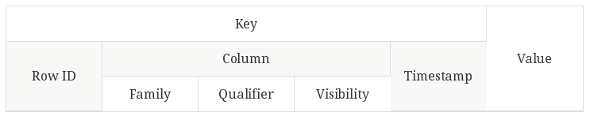

| Colonne           |                                      Définition                                     |
| ----------------- | :---------------------------------------------------------------------------------: |
| Row ID            |                            Unique identifier for the row                            |
| Column Family     | Logical grouping of the key. This field can be used to partition data within a node |
| Column Qualifier  |                          More specific attribute of the key                         |
| Column Visibility |               Security label controlling access to the key/value pair               |
| Timestamp         |                   Generated automatically and used for versioning                   |

DAY_OF_MONTH | DAY_OF_WEEK = date

OP_UNIQUE_CARRIER | OP_CARRIER_AIRLINE_ID | OP_CARRIER | TAIL_NUM | OP_CARRIER_FL_NUM = information transporteur 

ORIGIN_AIRPORT_ID | ORIGIN_AIRPORT_SEQ_ID | ORIGIN = information relative à propos de l'aéroport d'origine

DEST_AIRPORT_ID | DEST_AIRPORT_SEQ_ID | DEST = information relative à propos de l'aéroport d'arrivé

DEP_TIME | DEP_DEL15 | DEP_TIME_BLK = départ informations

ARR_TIME | ARR_DEL15 = information arrivé

CANCELLED | DIVERTED = information vol général

DISTANCE = information distance (à terre)
--------------------------------
ORIGIN_AIRPORT_ID | ORIGIN_AIRPORT_SEQ_ID | ORIGIN = information relative à propos de l'aéroport d'origine
DEST_AIRPORT_ID | DEST_AIRPORT_SEQ_ID | DEST = information relative à propos de l'aéroport d'arrivé

Super colonne = Aéroport information
-----------------------------------------------------------------
DEP_TIME | DEP_DEL15 | DEP_TIME_BLK = départ informations
ARR_TIME | ARR_DEL15 = information arrivé

Super colonne = Information délais
----------------------------------------------------------------
le resto solo